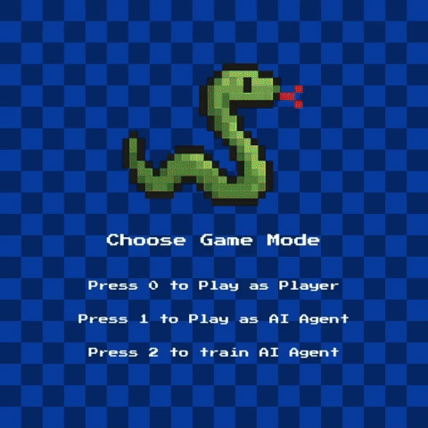

# Snake with Reinforcement Learning
This is a remake of the classic game Snake, created using Python and Deep Q-Network. 
The objective of the game is to eat as many pieces of food as possible without running 
into the walls or the snake's own tail. The more food the snake eats, the longer 
it becomes and the higher the score.

.

## How to Play:
- You need to satisfy application requirements.

- Once the game starts, use the arrow keys to control the snake. The up arrow moves the 
snake upwards, the down arrow moves it downwards, the left arrow moves it to the left, 
and the right arrow moves it to the right.

- The snake will automatically move forward, so you need to be careful not to run into 
the walls or the snake's own tail. If you do, the game will end.

## Requirements:
To run this game:
- Create virtual environment:
    ```
    python -m venv venv
    ```
- Activate virtual environment:
    ```
    venv\Scripts\activate
    ```
- Install required libraries:
    ```
    pip install -r requirements.txt
    ```
- Run script:
    ```
    python main.py
    ```

## Deep Q-Network
A Deep Q-Network (DQN) is a reinforcement learning algorithm that combines Q-learning with deep neural networks to enable agents to learn optimal actions in complex environments. 

It addresses the limitations of traditional Q-learning by using a neural network to approximate the Q-function, which estimates the optimal action values for each state.

## License
This project is licensed under the MIT License. See the LICENSE file for details.
